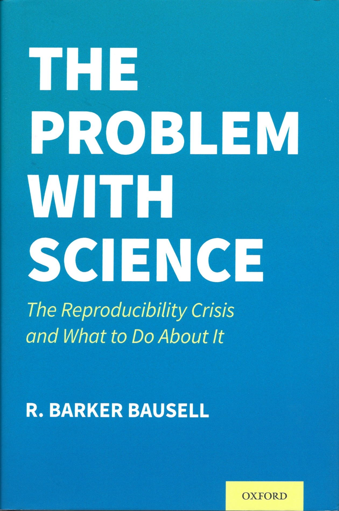

```{r setup, include=FALSE}
knitr::opts_chunk$set(echo = FALSE)
```

# We are...

## Rick Gilmore, Professor of Psychology

```{r}
knitr::include_graphics("https://psych.la.psu.edu/directory/rog1_/image_normal")
```

## Frank Hillary, Professor of Psychology

```{r}
knitr::include_graphics("https://psych.la.psu.edu/directory/fgh3/image_normal")
```

## Nicole Lazar, Professor of Statistics

```{r}
knitr::include_graphics("https://ecos-appdev-production.s3.amazonaws.com/science_site/s3fs-public/styles/f_story_image/public/2020-10/20200922-lazar-nicole-01-sq_copy.jpg?h=bfced127&itok=ST5Zl7wL")
```

## Briana Wham, Research Data Librarian - STEM, University Libraries

```{r}
knitr::include_graphics("https://libraries.psu.edu/sites/default/files/styles/staff_profiles/public/briana_wham.jpg?itok=rETPHdOF")
```

# Why we're here

---

<iframe width="560" height="315" src="https://www.youtube.com/embed/66oNv_DJuPc" title="YouTube video player" frameborder="0" allow="accelerometer; autoplay; clipboard-write; encrypted-media; gyroscope; picture-in-picture; web-share" allowfullscreen></iframe>

[@NYU_Health_Sciences_Library2013-gp](https://www.youtube.com/watch?v=66oNv_DJuPc)

---

```{r, fig.cap="[@Baker2016-rz](https://doi.org/10.1038/533452a)"}
knitr::include_graphics("http://www.nature.com/polopoly_fs/7.36716.1469695923!/image/reproducibility-graphic-online1.jpeg_gen/derivatives/landscape_630/reproducibility-graphic-online1.jpeg")
```

---

```{r, fig.cap="Have you heard of the ‘reproducibility crisis’ in science?", out.width="80%"}
knitr::include_graphics("https://penn-state-open-science.github.io/survey-fall-2022/include/img/fig-heard-of-repro-crisis-1.png")
```

---

```{r, fig.cap="Is there a reproducibility crisis in your area of research?", out.width="80%"}
knitr::include_graphics("https://penn-state-open-science.github.io/survey-fall-2022/include/img/fig-repro-crisis-your-area-1.png")
```

---

```{r, fig.show="hold", out.width="20%"}
knitr::include_graphics("include/img/chambers-seven-deadly-sins.jpg")
knitr::include_graphics("include/img/harris-rigor-mortis.jpg")

knitr::include_graphics("include/img/ritchie-science-fictions.jpg")
```

---

>"*We conducted the Reproducibility Project: Cancer Biology to investigate the replicability of preclinical research in cancer biology. The initial aim of the project was to repeat 193 experiments from 53 high-impact papers...*
>
> -- [@Errington2021-dp](https://doi.org/10.7554/eLife.67995)

---

>*However, the various barriers and challenges we encountered while designing and conducting the experiments meant that we were only able to repeat 50 experiments from 23 papers...This experience draws attention to a basic and fundamental concern about replication – **it is hard to assess whether reported findings are credible.***"
>
> -- [@Errington2021-dp](https://doi.org/10.7554/eLife.67995)

---

>"*...**you must not fool yourself—and you are the easiest person to fool**...After you’ve not fooled yourself, it’s easy not to fool other scientists.*"
>
> -- [@Feynman1974-ld](https://calteches.library.caltech.edu/51/2/CargoCult.htm)

---

>"*...I’m talking about a specific, **extra type of integrity** that is not lying, but **bending over backwards to show how you’re maybe wrong**, that you ought to do when acting as a scientist. And this is our responsibility as scientists, certainly to other scientists, and I think to laymen.*"
>
> -- [@Feynman1974-ld](https://calteches.library.caltech.edu/51/2/CargoCult.htm)

# Our ideas

---

```{r}

```

---

```{r}
knitr::include_graphics("include/img/psu-corr-fig-2.png")
```

---

```{r, fig.cap="Source: https://smartstudios.io/wp-content/uploads/2020/04/reinveting_the_wheel.png"}
knitr::include_graphics("https://smartstudios.io/wp-content/uploads/2020/04/reinveting_the_wheel.png")
```

---

Reproducibility + Replication = 

. . .

Robustness

. . . 

Robustness + Transparency = 

. . .

Rigor

. . .

Rigor + Reuse = 

. . .

Reach

[@Nosek2022-hv](https://doi.org/10.1146/annurev-psych-020821-114157); [@Gennetian2022-us](https://doi.org/10.1146/annurev-devpsych-120920-042335); [@Goodman2016-fi](http://stm.sciencemag.org/content/8/341/341ps12)

# Survey

## {data-background-iframe="https://forms.gle/eUGyWJPL226UNHfb8"}

## {data-background-iframe="https://penn-state-open-science.github.io/survey-fall-2022/"}

## {data-background-iframe="https://penn-state-open-science.github.io/survey-fall-2022/data-visualization.html"}

# Respondents

---

```{r, fig.cap="What is your primary department or unit?", out.width="80%"}
knitr::include_graphics("https://penn-state-open-science.github.io/survey-fall-2022/include/img/fig-dept-unit-1.png")
```

---

```{r, fig.cap="What is your position at Penn State?", out.width="80%"}
knitr::include_graphics("https://penn-state-open-science.github.io/survey-fall-2022/include/img/fig-position-1.png")
```

---

```{r, fig.cap="What is the highest post-secondary degree you have earned?", out.width="80%"}
knitr::include_graphics("https://penn-state-open-science.github.io/survey-fall-2022/include/img/fig-highest-degree-1.png")
```

---

```{r, fig.cap="How many years have passed since you completed that degree?", out.width="80%"}
knitr::include_graphics("https://penn-state-open-science.github.io/survey-fall-2022/include/img/fig-yrs-since-degree-1.png")
```

---

```{r, out.width="80%", fig.cap="What is your experience with/knowledge of open science practices?"}
knitr::include_graphics("https://penn-state-open-science.github.io/survey-fall-2022/include/img/fig-experience-w-open-science-1.png")
```

---

```{r, out.width="70%", fig.cap="Describe your awareness of the FAIR (findable, accessible, interoperable, reusable) principles pertaining to research data"}
knitr::include_graphics("https://penn-state-open-science.github.io/survey-fall-2022/include/img/fig-awareness-FAIR-1.png")
```

---

```{r, out.width="80%", fig.cap="Do you apply FAIR principles in your own data management and sharing practices?"}
knitr::include_graphics("https://penn-state-open-science.github.io/survey-fall-2022/include/img/fig-apply-FAIR-own-research-1.png")
```

# Data characteristics

---

```{r, fig.cap="What are the primary types of digital data that are used in your research?", out.width="80%"}
knitr::include_graphics("https://penn-state-open-science.github.io/survey-fall-2022/include/img/fig-primary-data-types-1.png")
```

---

```{r, out.width="100%"}
knitr::include_graphics("include/img/data-types-1.png")
```

---

```{r}
knitr::include_graphics("include/img/data-types-2.png")
```

---

```{r}
knitr::include_graphics("include/img/data-types-3.png")
```

---

```{r, fig.cap="Do you collect data that have legal or ethical restrictions governing who may access it or how it may be used?", out.width="80%"}
knitr::include_graphics("https://penn-state-open-science.github.io/survey-fall-2022/include/img/restricted-data-preprocess-1.png")
```

---

```{r, fig.cap="Where do you store data for active projects where data collection and analysis is still ongoing?", out.width="80%"}
knitr::include_graphics("https://penn-state-open-science.github.io/survey-fall-2022/include/img/fig-data-storage-places-1.png")
```

# Sharing with collaborators

---

```{r, out.width="70%", fig.cap="How important to you is sharing data from active projects with research collaborators at Penn State or outside of Penn State?"}
knitr::include_graphics("https://penn-state-open-science.github.io/survey-fall-2022/include/img/fig-import-share-collab-1.png")
```

---

```{r, fig.cap="How convenient is it for you to share data from active projects with research collaborators at Penn State or outside of Penn State?", out.width="70%"}
knitr::include_graphics("https://penn-state-open-science.github.io/survey-fall-2022/include/img/fig-convenient-share-collab-1.png")
```

## {data-background-iframe="https://penn-state-open-science.github.io/survey-fall-2022/data-visualization.html#barriers-to-sharing-with-research-collaborators"}

---

```{r, out.width="80%", fig.cap="How often do you share computer scripts or data analysis code with direct research collaborators ?"}
knitr::include_graphics("https://penn-state-open-science.github.io/survey-fall-2022/include/img/fig-how-often-share-code-1.png")
```

# Sharing with community

---

```{r, fig.cap="How important to you is sharing data from completed projects with the broader research community (i.e., not direct collaborators)?", out.width="70%"}
knitr::include_graphics("https://penn-state-open-science.github.io/survey-fall-2022/include/img/fig-import-share-community-1.png")
```

---

```{r, fig.cap="Which of the following obstacles make sharing data with the research community harder for you?", out.width="70%"}
knitr::include_graphics("https://penn-state-open-science.github.io/survey-fall-2022/include/img/fig-obstacles-to-sharing-w-comm-1.png")
```

---

```{r, fig.cap="If you have shared data with the research community, where have you shared it?", out.width="80%"}
knitr::include_graphics("https://penn-state-open-science.github.io/survey-fall-2022/include/img/fig-where-data-shared-1.png")
```

---

```{r, out.width="70%", fig.cap="How often do you openly share other materials related to your research (protocols, reagents, samples, apparatus, designs, etc.) with other researchers?"}
knitr::include_graphics("https://penn-state-open-science.github.io/survey-fall-2022/include/img/fig-share-materials-community-1.png")
```

# Sharing requirements

---

```{r, out.width="80%", fig.cap="Do research funders in your field require data sharing?"}
knitr::include_graphics("https://penn-state-open-science.github.io/survey-fall-2022/include/img/fig-funders-require-data-sharing-1.png")
```

---

```{r, out.width="80%", fig.cap="Do journals in your field require data sharing?"}
knitr::include_graphics("https://penn-state-open-science.github.io/survey-fall-2022/include/img/fig-journals-require-data-sharing-1.png")
```

---

```{r, out.width="80%", fig.cap="Do funders in your field require code sharing?"}
knitr::include_graphics("https://penn-state-open-science.github.io/survey-fall-2022/include/img/fig-funders-require-code-sharing-1.png")
```

# What's next?

---

```{r, out.width="70%", fig.cap="How much benefit would you derive from a center at Penn State focused on supporting the adoption of best practices in data management and sharing, code sharing, open science, and reproducible research?"}
knitr::include_graphics("https://penn-state-open-science.github.io/survey-fall-2022/include/img/fig-benefit-from-psu-ctr-1.png")
```

---

```{r, out.width="80%", fig.cap="Select the services that would most benefit your research if offered by such a center."}
knitr::include_graphics("https://penn-state-open-science.github.io/survey-fall-2022/include/img/fig-services-from-center-1.png")
```

## Open science @ PSU

<https://github.com/penn-state-open-science/roadmap/>

- Feb 13-17: [International Love Data Week](https://www.icpsr.umich.edu/web/about/cms/1576): "Agents of Change".
- Spring 2023: Library hiring new staff in data management and curation
- Spring 2023: [PSYCH 490](https://psu-psychology.github.io/psych-490-reproducibility-2023-spring/): The reproducibility crisis in science
- Spring-Summer 2023: Data management plan policy roll-out
- August 2023: Open Science Bootcamp

---

```{r, fig.cap="Source: https://media2.giphy.com/media/BpGWitbFZflfSUYuZ9/giphy.gif"}
knitr::include_graphics("https://media2.giphy.com/media/BpGWitbFZflfSUYuZ9/giphy.gif")
```

# Resources

---

This talk was produced on `r Sys.Date()` in [RStudio](http://rstudio.com/) using [R Markdown](https://rmarkdown.rstudio.com) and the [reveal.js](https://revealjs.com) framework.

Information about the R Session that produced the code is as follows:

```{r session-info}
sessionInfo()
```

## Code

**GitHub repo**: <https://github.com/penn-state-open-science/>

**Survey protocol & results**: <https://penn-state-open-science.github.io/survey-fall-2022/>

---

**Talk slides**: <https://penn-state-open-science.github.io/2023-02-17-Child-Study-Center/>

```{r, echo=FALSE}
library(qrcode)
code <- qr_code("https://penn-state-open-science.github.io/2023-02-17-Child-Study-Center/")
plot(code)
```

## References
